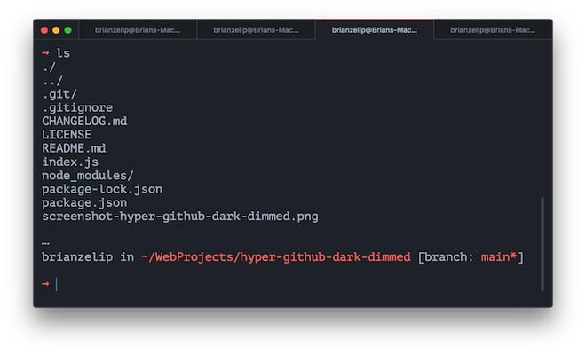

# Changelog

All notable changes to this project will be documented in this file.

The format is based on [Keep a Changelog](https://keepachangelog.com/en/1.0.0/),
and this project adheres to [Semantic Versioning](https://semver.org/spec/v2.0.0.html).

## [Unreleased]

## [1.0.0] - 2021-06-27

🚢 🎉

This work changes the source of the theme data. The data now comes from one step up Primer's design system stack - instead of primitives, the source is now github-vscode-theme (which in turn pulls from primitives). github-vscode-theme was not available via npm, so I had to create github-vscode-themes npm package.

Making this change allowed me to more accurately follow VSCode's implementation of the dark dimmed theme.

### Added

- github-vscode-themes dependency

### Updated

- index.js
  - Refactor data based on new github-vscode-themes dependency
  - Add more state variables
  - Style border-top-right-radius of last tab when not active
  - Removed ANSI gray since the new theme dependency doesn't provide it
- package.json description and keywords
- README

### Removed

- @primer/primitives dependency

## [0.2.4] - 2021-06-10

### Updated

- index.js
  - add icon hover state styles
  - update header
  - add var grouping comments

## [0.2.3] - 2021-06-10

### Updated

- index.js: Override `.tabs_nav` border
- readme: Add Related

## [0.2.2] - 2021-06-07

### Updated

- index.js
  - refactor var names
  - fix header @link
  - bump header version
- Readme: Add npm version badge from shields.io
- screenshot: better quality

## [0.2.1] - 2021-06-07

### Updated

- readme: Fix install script

## [0.2.0] - 2021-06-07

### Added

- screenshot

### Updated

- index.js
  - import primitives data
  - refactor ansi colors
  - finalize hyper css selectors and styling approach
  - finalize js vars and property values
- readme: Add screenshot and metadata

### Removed

- prior art/

## [0.1.1] - 2021-06-05

### Added

- proper @primer/primitives npm depedency for GitHub Dark Dimmed colors
- Some custom css to index.js
- CHANGELOG
- LICENSE MIT

### Updated

- package.json metadata and dependecies

### Removed

- primer/primitives manual prior art

## [0.1.0] - 2021-06-04

### Added

- Prior art for Hyper themes from New Moon and Cobalt2, and [@primer/primitives@v4.3.9 manually via weird npm snafu](https://github.com/primer/primitives/issues/127)
- package.json
- package-lock.json
- index.js
- README with title and description only
- .gitignore

[unreleased]: https://github.com/brianzelip/hyper-github-dark-dimmed/compare/v0.1.0...HEAD
[1.0.0]: https://github.com/brianzelip/hyper-github-dark-dimmed/compare/v0.1.0...v1.0.0
[0.2.4]: https://github.com/brianzelip/hyper-github-dark-dimmed/compare/v0.1.0...v0.2.4
[0.2.3]: https://github.com/brianzelip/hyper-github-dark-dimmed/compare/v0.1.0...v0.2.3
[0.2.2]: https://github.com/brianzelip/hyper-github-dark-dimmed/compare/v0.1.0...v0.2.2
[0.2.1]: https://github.com/brianzelip/hyper-github-dark-dimmed/compare/v0.1.0...v0.2.1
[0.2.0]: https://github.com/brianzelip/hyper-github-dark-dimmed/compare/v0.1.0...v0.2.0
[0.1.1]: https://github.com/brianzelip/hyper-github-dark-dimmed/compare/v0.1.0...v0.1.1
[0.1.0]: https://github.com/brianzelip/hyper-github-dark-dimmed/releases/tag/v0.1.0
